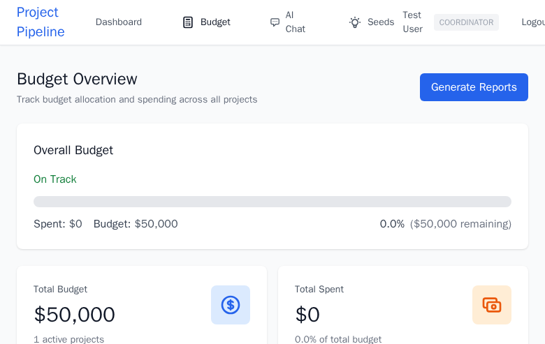

# Budget Calculator - Erasmus+ Budget Planning

## What is the Budget Calculator?

The Budget Calculator automatically calculates project costs using official Erasmus+ unit cost rules. It takes your project details (participants, countries, duration, distances) and generates accurate budget estimates aligned with EU funding requirements.



## Why Use the Budget Calculator?

- **Accuracy** - Uses official Erasmus+ unit cost tables
- **Speed** - Instant calculations as you change project details
- **Compliance** - Ensures budget follows EU rules
- **Transparency** - See exactly how costs are calculated
- **Scenarios** - Test different participant numbers or destinations
- **Export-ready** - Budget formats match application requirements

## How It Works

The calculator uses Erasmus+ unit cost methodology:

1. **You provide:**
   - Number of participants
   - Countries involved (origin and destination)
   - Project duration (days)
   - Travel distances
   - Activity type (youth exchange, training, etc.)

2. **Calculator determines:**
   - Applicable unit cost rates (per country, per day)
   - Travel cost bands (by distance)
   - Eligible cost categories
   - Maximum funding amounts

3. **You receive:**
   - Total budget breakdown
   - Category-by-category costs
   - Co-funding requirements
   - Budget summary for application

## Budget Categories

### 1. Travel Costs

**How it's calculated:**
- Based on distance between sending and host countries
- Uses EU distance calculator
- Categorized into distance bands (0-99 km, 100-499 km, etc.)
- Fixed amount per participant per distance band

**Distance bands (example - check current rates):**
```
0-99 km:        €23 per participant
100-499 km:     €180 per participant
500-1999 km:    €275 per participant
2000-2999 km:   €360 per participant
3000-3999 km:   €530 per participant
4000-7999 km:   €820 per participant
8000+ km:       €1500 per participant
```

**Calculator automatically:**
- Calculates distances between capital cities
- Determines correct band
- Applies rate to participant count
- Includes group leaders in calculation

**You can override:**
- Exact distances (if using different cities)
- Green travel supplement (trains vs. planes)

### 2. Organisational Support

**Covers:**
- Preparation costs
- Materials and supplies
- Communication
- Administrative expenses
- Evaluation costs

**How it's calculated:**
- Fixed amount per day per participant
- Varies by country (host country rates apply)
- Typically €8-€12 per participant per day

**Example:**
```
20 participants × 7 days × €10/day = €1,400
```

### 3. Individual Support (Accommodation + Food)

**Covers:**
- Accommodation
- Meals
- Local transport

**How it's calculated:**
- Fixed amount per day per participant
- Varies by host country
- Includes both participants and group leaders

**Typical rates (varies by country):**
```
Eastern Europe:  €35-45 per day
Western Europe:  €55-65 per day
Nordic countries: €60-75 per day
```

**Example:**
```
20 participants × 7 nights × €50/night = €7,000
```

### 4. Exceptional Costs (if applicable)

**For:**
- Expensive travel (remote regions)
- Visa costs
- Residence permits
- Vaccinations

**How it's calculated:**
- Real costs (not unit costs)
- Maximum 80% of total grant
- Requires invoices and justification

### 5. Inclusion Support

**For participants with:**
- Disabilities
- Health issues
- Mobility limitations
- Special educational needs
- Economic barriers

**How it's calculated:**
- Additional support costs
- Real costs up to €100 per participant
- Over €100: additional justification needed
- Can cover assistants, equipment, adaptations

## Using the Calculator

### Step 1: Enter Project Basics

Navigate to **Budget** tab in your project.

**Verify auto-filled data:**
- Number of participants (from project)
- Number of group leaders
- Origin countries (from participant list)
- Host country (from project location)
- Duration (from timeline)

**Edit if needed:**
- Adjust participant numbers
- Add/remove group leaders
- Change countries or duration

### Step 2: Calculate Distances

**Automatic calculation:**
- Calculator uses EU distance tool
- Measures from capital to capital
- Determines distance band
- Applies unit cost

**Manual override:**
```
"We're actually departing from Malmö, not Stockholm.
Can you update the distance?"
```

**Green travel bonus:**
- If using train/bus instead of plane
- EU provides travel time supplement
- Up to 4 extra travel days funded
- Select "Green Travel" option

### Step 3: Review Category Breakdown

Calculator shows:

**Travel:**
- Per participant cost
- Total travel budget
- Green travel supplement (if applicable)

**Organisational Support:**
- Daily rate
- Number of days
- Total organisational costs

**Individual Support:**
- Daily rate for host country
- Number of participant-days
- Total accommodation/food costs

**Total Budget:**
- Sum of all categories
- EU contribution amount
- Co-funding required (if any)

### Step 4: Adjust as Needed

**Test scenarios:**
- Change participant numbers: "What if we invite 25 instead of 20?"
- Adjust duration: "How much for 10 days instead of 7?"
- Try different countries: "What if we host in Portugal instead of Sweden?"

**Compare options:**
- Budget calculator updates in real-time
- See impact of changes immediately
- Choose the option that fits your capacity

### Step 5: Add Special Costs

**Inclusion support:**
- Click "Add Inclusion Support"
- Specify participant needs
- Enter estimated costs
- Calculator adds to total

**Exceptional costs:**
- Click "Add Exceptional Costs"
- Describe the exceptional circumstance
- Enter amount and justification
- Note: Requires additional approval

## Budget Best Practices

### 1. Be Realistic About Numbers

Don't inflate participant numbers:
- Budget for who you can realistically recruit
- Consider dropout rates (10-20% typical)
- Ensure you can find enough suitable participants

### 2. Account for Co-Funding

Erasmus+ rarely funds 100%:
- Check if co-funding is required
- Plan how you'll cover it (participant fees, partner contributions)
- Be transparent about costs in partner agreements

### 3. Use Green Travel When Possible

Trains/buses offer benefits:
- Extra travel days funded (up to 4 days)
- Environmental sustainability
- Cultural experience
- Often easier logistics than flights

### 4. Plan for Inclusion

Budget for accessibility:
- Even if current participants don't need support
- Shows commitment to inclusion
- Makes last-minute accommodations possible
- Required for quality Erasmus+ projects

### 5. Document Assumptions

Keep notes on:
- Why you chose certain numbers
- Distance calculation methods
- Green travel decisions
- Inclusion support estimates

Helps during:
- Application writing
- Partner negotiations
- Reporting (if approved)

## Understanding Unit Costs vs. Real Costs

### Unit Costs (Most of Budget)

**How they work:**
- Fixed amounts set by EU
- Don't require receipts
- Can spend more or less than unit cost
- Funding is fixed regardless of actual spending

**Example:**
```
You receive: €50/day for accommodation
You spend: €40/day on hostel
You keep: €10/day (can use for other project costs)
```

**OR**

```
You receive: €50/day for accommodation
You spend: €60/day on hotel
You pay extra: €10/day from your own funds
```

**Advantage:**
- Simplified accounting
- Flexibility in spending
- Less paperwork

### Real Costs (Exceptional Items)

**How they work:**
- Actual expenses
- Must provide invoices/receipts
- Reimbursed up to approved amount
- Subject to audit

**When required:**
- Exceptional costs category
- High-value inclusion support
- Some travel exceptional circumstances

**Example:**
```
Approved: €500 for participant visa costs
You spend: €450 with invoices
Reimbursed: €450
```

## Common Budget Questions

**Q: Can I change the budget after submission?**
A: Minor adjustments usually allowed. Major changes may require approval or amendment.

**Q: What if real costs are lower than unit costs?**
A: You keep the difference. Unit costs are fixed regardless of actual spending.

**Q: What if I need to add participants?**
A: Contact your National Agency. May require budget amendment.

**Q: Do participants pay fees?**
A: Erasmus+ projects should be free for participants. Budget covers eligible costs.

**Q: What's not covered by Erasmus+ budget?**
A: Typically: equipment purchases, infrastructure, overhead beyond organisational support, profit.

**Q: How do I prove costs?**
A: For unit costs, timesheets and attendance records. For real costs, invoices and receipts.

**Q: Can I transfer money between budget categories?**
A: Generally no. Each category is fixed. Check with National Agency for exceptions.

## Budget Export

Your budget exports with your project:

**Included in:**
- PDF application documents
- Word documents for editing
- Excel spreadsheets for analysis

**Format matches:**
- Erasmus+ application requirements
- National Agency expectations
- Standard budget templates

## Next Steps

With budget calculated:
1. [Search for vendors](vendor-search.md) - Find accommodation/food within budget
2. [Finalize your programme](programmes.md) - Ensure activities fit budget
3. [Export your application](export.md) - Budget is included

---

**Questions about Erasmus+ budget rules?**
- Check Erasmus+ Programme Guide: [https://erasmus-plus.ec.europa.eu/programme-guide](https://erasmus-plus.ec.europa.eu/programme-guide)
- Contact your National Agency
- Email us: info@openhorizon.cc
