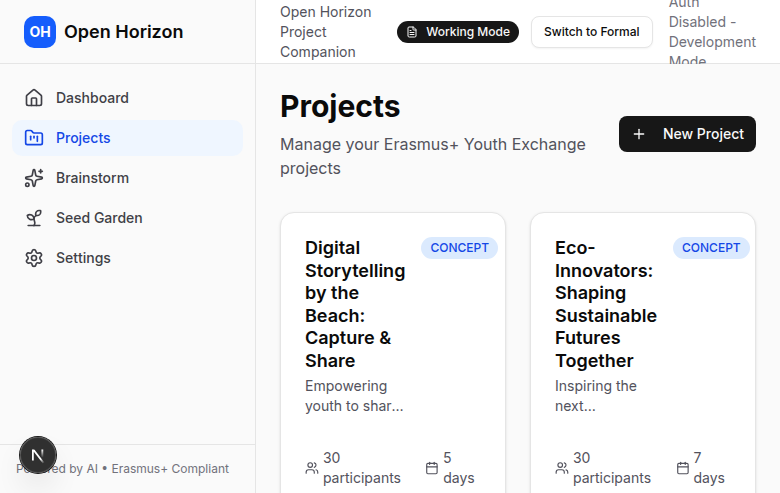

# Projects - Full Project Management

## What is a Project?

A **project** in OpenHorizon is a complete Erasmus+ project plan with phases, timelines, participants, budgets, and all details needed for your application. Projects are created from seeds (or from scratch) and contain everything from initial planning to submission-ready documentation.

## Creating a Project

### From a Seed

The most common way to create a project:

1. Generate or select a seed from your Garden
2. Optionally elaborate to refine it
3. Click **"Convert to Project"**
4. AI automatically generates:
   - Project phases (preparation, travel, activities, follow-up)
   - Gantt chart timeline
   - Participant structures
   - Budget framework
   - Activity schedules

### From Scratch (Advanced)

You can also create empty projects and fill in details manually:

1. Dashboard → "New Project" → "Create from Scratch"
2. Enter basic details (title, description, duration)
3. Build phases and content manually

**When to use:**
- You have a very specific project in mind
- You're importing from external plans
- You prefer manual control over AI generation

## Project Structure


Every project contains:

### 1. Overview Section
- **Title** (formal and informal)
- **Description** (short and long versions)
- **Target group** and participant details
- **Duration** and timeline
- **Partner countries**
- **Learning objectives**

### 2. Gantt Chart Timeline

Visual timeline showing:
- All project phases
- Start and end dates
- Dependencies between phases
- Milestones and deadlines
- Current progress

**Interact with the Gantt chart:**
- Zoom in/out for detail
- Click phases to view details
- Drag to adjust dates (if enabled)
- Export as image or PDF

### 3. Project Phases

Default phases (can be customized):

**Preparation** - Planning before the activity
- Team formation
- Partner communication
- Logistics planning
- Participant selection

**Travel** - Getting to the destination
- Departure
- Transportation
- Arrival

**Activities** - Main project activities
- Workshops
- Discussions
- Cultural activities
- Learning sessions
- Team building

**Follow-up** - After the activity
- Reflection and evaluation
- Dissemination
- Reporting
- Impact assessment

### 4. Participants

Participant management:
- Total number
- Age ranges
- Countries represented
- Special needs
- Group leaders vs. participants
- Fewer opportunities groups

### 5. Budget

Budget overview:
- Total costs
- Category breakdown
- Erasmus+ unit costs
- Co-funding requirements

See [Budget Calculator](budget.md) for details.

### 6. Programme

Detailed daily schedules built with the Programme Builder.

See [Programme Builder](programmes.md) for details.

## Managing Phases

### Viewing Phase Details

Click any phase to see:
- Full description
- Timeline and duration
- Activities and tasks
- Responsible persons
- Resources needed
- Budget allocated

### Editing Phases

**Edit phase details:**
1. Click the phase
2. Click **"Edit"** button
3. Modify:
   - Phase name and description
   - Start and end dates
   - Activities list
   - Budget allocation
   - Responsible persons

**Add activities:**
1. Within a phase, click **"Add Activity"**
2. Enter activity details:
   - Name and description
   - Date and time
   - Location
   - Facilitator
   - Materials needed

**Delete phases:**
- Click phase → "Delete" (careful - this cannot be undone!)

### Creating Custom Phases

Need additional phases?

1. Click **"Add Phase"**
2. Choose placement (before/after existing phase)
3. Define:
   - Phase name
   - Duration
   - Purpose
   - Key activities

**Common custom phases:**
- "Pre-departure training"
- "Mid-project evaluation"
- "Interim reporting"
- "Partner meetings"

## AI Project Assistant

Every project has an AI assistant that understands your full project context.

**Access it:**
Project view → "Chat with AI" button

**What you can ask:**
```
"Suggest icebreaker activities for the first day"
"How should I structure the evaluation phase?"
"What learning objectives work for climate action projects?"
"Help me write a description for the 'Team Building' activity"
"What should I budget for accommodation in Barcelona?"
```

**The AI knows:**
- Your project theme and objectives
- Target group characteristics
- Duration and timeline
- Budget constraints
- Partner countries

**Tips for better responses:**
- Be specific about what you need
- Reference specific phases or activities
- Ask follow-up questions to refine answers
- Request multiple options ("Give me 3 icebreaker ideas")

## Phase-Specific AI Agents

Some phases have specialized AI agents:

### Accommodation Agent
- Search hotels, hostels, youth centers
- Compare prices and locations
- Get pros/cons analysis
- Request quotes

### Travel Agent
- Find flights and transportation
- Compare routes and prices
- Get travel recommendations

### Food Agent
- Search caterers and restaurants
- Get menu suggestions
- Compare pricing
- Request catering quotes

See [Vendor Search](vendor-search.md) for details.

## Organizing Multiple Projects

### Projects Dashboard



Your dashboard shows:
- All active projects
- Recently modified
- Upcoming deadlines
- Project status (draft, in progress, submitted)

**Filter and sort:**
- By status (draft, active, completed)
- By deadline
- By funding programme (KA1, KA2, etc.)
- By theme or target group

### Project Status

Track project lifecycle:

**Draft** - Initial planning
- Still developing concept
- Not ready for submission
- Gathering information

**In Progress** - Active development
- Budget being calculated
- Vendors being researched
- Programme being built
- Application in preparation

**Ready for Review** - Nearly complete
- All sections filled
- Budget finalized
- Ready for partner review

**Submitted** - Application sent
- Waiting for decision
- Archived for reference

**Approved/Rejected** - Final decision received

### Archiving Projects

Archive old projects to keep your dashboard clean:
1. Click project → "Settings"
2. Choose **"Archive Project"**
3. Archived projects can be restored anytime

**Archived projects:**
- Remain accessible
- Don't appear in main dashboard
- Can be used as templates
- Serve as historical reference

## Collaborating on Projects

### Sharing Project Details

Export and share with partners:
1. Click **"Export"** → "Share Link" (if enabled)
2. Or export to PDF/Word and send

### Comments and Notes

Add internal notes:
- Phase-level notes (visible only to you)
- Activity comments
- Budget notes
- Overall project notes

**Good for:**
- Tracking decisions
- Recording partner feedback
- Noting questions for later
- Saving research findings

## Templates and Cloning

### Using Projects as Templates

Create a new project based on an existing one:

1. Open a completed project
2. Click **"Use as Template"**
3. New project created with same structure
4. Update specific details (dates, countries, participants)

**Great for:**
- Running similar projects annually
- Adapting successful projects to new themes
- Reusing proven structures

### Cloning Projects

Make an exact copy:
1. Project → "Settings" → "Clone Project"
2. Gives you duplicate to experiment with
3. Original remains untouched

**Use cases:**
- Test different budgets scenarios
- Compare different programme structures
- Create variations for different funding calls

## Best Practices

### 1. Start with a Strong Seed

Don't rush project creation:
- Generate multiple seed batches
- Elaborate promising ideas
- Get the foundation right before converting

### 2. Review Auto-Generated Content

AI does great work, but always review:
- Phase descriptions - do they match your vision?
- Timeline - is it realistic?
- Activities - are they achievable?
- Budget - does it align with your capacity?

### 3. Build Programme Early

Don't leave programme building until last:
- It helps clarify budget needs
- Reveals logistical questions early
- Makes vendor search more targeted
- Shows partners what you're planning

### 4. Use AI Assistants

The AI knows your project - leverage it:
- Stuck on activity ideas? Ask AI
- Need help with descriptions? Ask AI
- Unsure about timeline? Ask AI
- Want to refine objectives? Ask AI

### 5. Track Changes

Keep notes on major decisions:
- Why you chose certain activities
- Partner feedback and agreements
- Budget assumptions
- Timeline rationale

This helps during:
- Partner meetings
- Application writing
- Reporting (if approved)
- Running similar future projects

## Common Questions

**Q: Can I have multiple projects?**
A: Yes, unlimited projects!

**Q: Can I delete a project?**
A: Yes, but consider archiving instead (preserves history).

**Q: How long does project generation take?**
A: 30-60 seconds for a complete project with all phases.

**Q: Can I change the auto-generated timeline?**
A: Yes, all dates and durations are editable.

**Q: Do projects sync with partners?**
A: Not currently. Export and share manually. Live collaboration is planned.

**Q: Can I merge two projects?**
A: Not automatically, but you can manually combine content from multiple projects.

**Q: What's the difference between phases and activities?**
A: Phases are large chunks (e.g., "Preparation"), activities are specific tasks within phases (e.g., "Team meeting on Tuesday").

## Next Steps

Now that you understand projects:
1. [Build a detailed programme](programmes.md)
2. [Calculate your budget](budget.md)
3. [Search for vendors](vendor-search.md)
4. [Export for submission](export.md)

---

**Need help?** Check our [Troubleshooting Guide](../troubleshooting.md) or email info@openhorizon.cc
