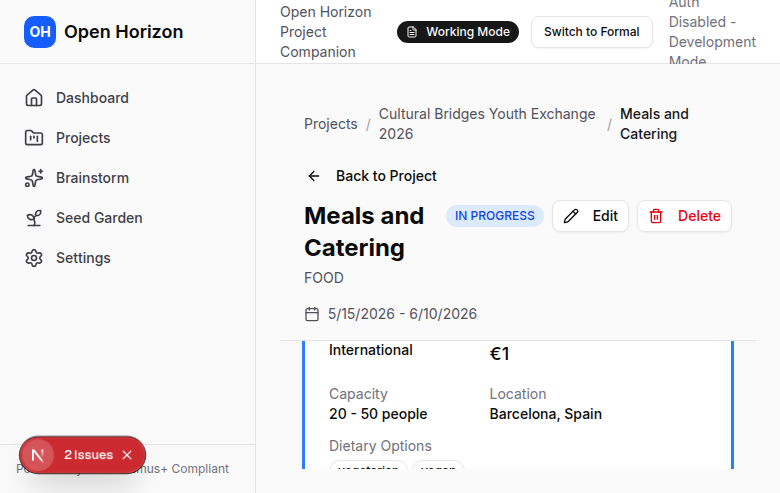

# Getting Started with OpenHorizon

## What is OpenHorizon?

OpenHorizon is an AI-powered platform that helps you plan Erasmus+ projects from initial idea to submission-ready application. Transform 40-60 hours of manual planning into 4-6 hours of guided, AI-assisted workflow.

## Your First Project in 5 Minutes

### Step 1: Sign Up and Log In

1. Go to [https://app.openhorizon.cc](https://app.openhorizon.cc)
2. Click "Sign Up" to create your account
3. Sign up with email or Google account
4. You'll land on your dashboard


### Step 2: Generate Project Ideas

Your journey starts with "seeds" - AI-generated project ideas based on your brainstorming prompt.

1. From your dashboard, click **"Generate New Project Ideas"**
2. Enter a brainstorming prompt describing what you want to create

**Example prompts:**
- "Youth exchange about digital skills for rural youth in Sweden and Poland, ages 16-20"
- "Training course for youth workers on climate action, 5 days in Barcelona"
- "Mobility project about social entrepreneurship for young adults"

3. Click **"Generate"** and wait 10-20 seconds
4. Browse 5-15 AI-generated seed ideas, each with:
   - Informal and formal titles
   - Detailed descriptions
   - Target group and activities
   - Approval likelihood score
   - AI reasoning for why it's a good idea

**What to do with seeds:**
- **Save** - Add to your Seed Garden to revisit later
- **Elaborate** - Refine the idea through conversation with AI
- **Convert to Project** - Skip elaboration and create a full project immediately

### Step 3: Elaborate Your Seed (Optional)

If you want to refine an idea before creating a project:

1. Click **"Elaborate"** on your chosen seed
2. Have a conversation with the AI to refine details:
   - Ask about specific activities
   - Adjust target group
   - Refine learning objectives
   - Explore logistical details

**Example conversation:**
```
You: "What activities would work for 15-year-olds?"
AI: [Suggests age-appropriate workshops and outdoor activities]

You: "Focus more on hands-on workshops, less on lectures"
AI: [Refines activity list to be more interactive]

You: "Add outdoor team-building components"
AI: [Adds outdoor activities to the programme]
```

3. When satisfied, click **"Convert to Project"**

### Step 4: View Your Project

Once converted, your project appears with automatically generated content:


**What's included:**
- **Project phases** - Preparation, travel, activities, follow-up
- **Gantt chart timeline** - Visual project schedule
- **Participant lists** - Group size and demographics
- **Budget framework** - Initial cost estimates
- **Phase details** - Detailed breakdown of each project stage

**You can:**
- Edit any phase (click to view details)
- Chat with AI for project-specific questions
- Build detailed programmes
- Calculate accurate budgets
- Search for vendors

### Step 5: Build Your Programme

Create a detailed day-by-day schedule:

1. Navigate to a phase (e.g., "Activities")
2. Click **"Programme Builder"**
3. Add daily activities:
   - Drag and drop to schedule
   - Set times and locations
   - Add descriptions and facilitators
   - Include breaks and free time

**Best practices:**
- Start with ice-breakers
- Mix activity types (workshops, discussions, outdoor, cultural)
- Include reflection sessions
- Add buffer time (things often run late!)

### Step 6: Calculate Your Budget

OpenHorizon automatically calculates budgets using official Erasmus+ unit cost rules:


1. Navigate to the **"Budget"** tab
2. Review auto-calculated costs:
   - Travel costs (based on distance)
   - Accommodation (per diem rates)
   - Programme costs
   - Special needs support
   - Organisational costs

**The calculator:**
- Uses official Erasmus+ unit cost tables
- Calculates distances automatically
- Updates in real-time as you change project details
- Shows breakdown by category

### Step 7: Find Vendors (Coming Soon)

Search for accommodation, travel, and catering options:



1. Navigate to **"Vendor Search"**
2. Choose category:
   - **Accommodation** - Hotels, hostels, youth centers
   - **Travel** - Flights, buses, travel agencies
   - **Food** - Caterers, restaurants

3. AI analyzes options with pros and cons
4. Select vendors and generate quote request emails
5. Track responses in one place

### Step 8: Export Your Project

When ready to submit your Erasmus+ application:

1. Click **"Export"** in the top menu
2. Choose your format:
   - **PDF** - For printing and sharing
   - **Word (DOCX)** - For further editing
   - **Excel** - For budget analysis

3. Download your application-ready document

**What's included:**
- Complete project description
- Detailed programme schedules
- Budget breakdown
- Participant information
- Erasmus+ application forms (KA1/KA2)

## Next Steps

Now that you've created your first project, explore more features:

- [Learn about Seeds](features/seeds.md) - Master project ideation
- [Project Management](features/projects.md) - Organize complex projects
- [Programme Builder](features/programmes.md) - Create detailed schedules
- [Budget Calculator](features/budget.md) - Understand Erasmus+ budgeting
- [Vendor Search](features/vendor-search.md) - Find and compare vendors
- [Document Export](features/export.md) - Prepare submission-ready documents

## Need Help?

- **Troubleshooting** - [Common issues and solutions](troubleshooting.md)
- **Email Support** - info@openhorizon.cc
- **Bug Reports** - [GitHub Issues](https://github.com/gpt153/openhorizon.cc/issues)

---

**Welcome to OpenHorizon!** We're here to make Erasmus+ project planning faster, easier, and more effective. 🚀
