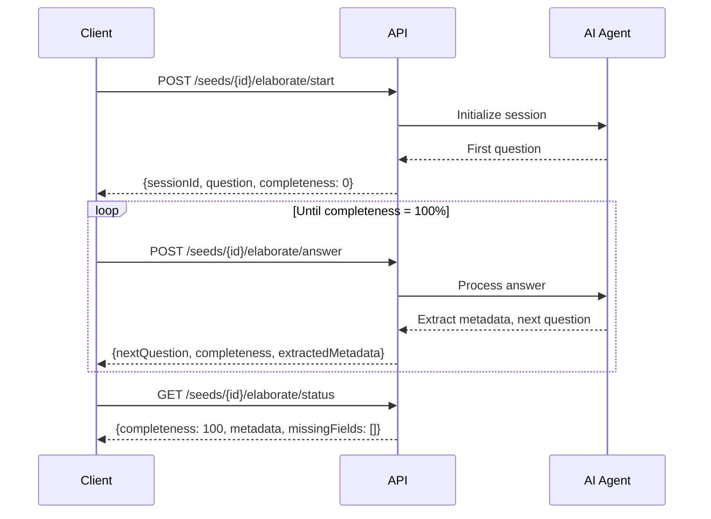

# Seed Elaboration API Documentation

This directory contains comprehensive API documentation for the Seed Elaboration endpoints.

## 📁 Contents

- **`openapi-seed-elaboration.yaml`** - Complete OpenAPI 3.0 specification
- **`../api-examples/`** - Integration examples in multiple languages

## 🚀 Quick Start

### 1. View the Documentation

You can view the API documentation in several ways:

#### Using Swagger UI (Local)

```bash
# Install swagger-ui-watcher
npm install -g swagger-ui-watcher

# Serve the documentation
swagger-ui-watcher openapi-seed-elaboration.yaml
```

Then open http://localhost:8000 in your browser.

#### Using Redocly (Recommended)

```bash
# Install Redocly CLI
npm install -g @redocly/cli

# Preview the documentation
redocly preview-docs openapi-seed-elaboration.yaml
```

#### Using Swagger Editor Online

1. Go to https://editor.swagger.io/
2. Copy and paste the contents of `openapi-seed-elaboration.yaml`

### 2. Validate the Specification

```bash
# Using Redocly (recommended)
npx @redocly/cli lint openapi-seed-elaboration.yaml

# Or using swagger-cli
npx @apidevtools/swagger-cli validate openapi-seed-elaboration.yaml
```

## 📚 API Overview

The Seed Elaboration API provides three main endpoints:

### 1. Start Elaboration Session

**`POST /seeds/{id}/elaborate/start`**

Starts a new conversational elaboration session for a seed.

**Response:**
- Session ID
- First question
- Completeness tracking (0-100%)
- Quick reply suggestions

### 2. Submit Answer

**`POST /seeds/{id}/elaborate/answer`**

Submits an answer to the current question and receives the next question.

**Request:**
```json
{
  "sessionId": "uuid",
  "answer": "User's natural language answer"
}
```

**Response:**
- Next question (or null if complete)
- Extracted metadata from answer
- Updated completeness percentage
- Suggestions for next answer

### 3. Get Elaboration Status

**`GET /seeds/{id}/elaborate/status`**

Retrieves the current elaboration progress and metadata.

**Response:**
- Completeness percentage
- All collected metadata
- List of missing fields

## 🔑 Authentication

All endpoints require JWT authentication:

```
Authorization: Bearer <your-jwt-token>
```

Obtain a JWT token via the `/auth/login` endpoint.

## 📊 Metadata Tracked

The API tracks comprehensive metadata through conversational interaction:

| Category | Fields | Example |
|----------|--------|---------|
| **Participants** | Count, countries, age range | 30 people, aged 18-25, from TR/ES/DE |
| **Timeline** | Duration, start date, end date | 7 days, July 15-21, 2024 |
| **Budget** | Total, per-participant | €15,000 total, €500/participant |
| **Destination** | Country, city, venue | Barcelona, Spain, Youth Hostel |
| **Requirements** | Visas, insurance, permits | Travel insurance required |
| **Activities** | Name, duration, budget | Cultural workshop, 2 days |
| **EU Alignment** | Priorities, learning objectives | Inclusion, Green, Digital |

## 💡 Integration Examples

### cURL

```bash
# Start session
curl -X POST http://localhost:3000/seeds/{id}/elaborate/start \
  -H "Authorization: Bearer $JWT_TOKEN"

# Submit answer
curl -X POST http://localhost:3000/seeds/{id}/elaborate/answer \
  -H "Authorization: Bearer $JWT_TOKEN" \
  -H "Content-Type: application/json" \
  -d '{"sessionId":"uuid","answer":"30 young people aged 18-25"}'

# Check status
curl -X GET http://localhost:3000/seeds/{id}/elaborate/status \
  -H "Authorization: Bearer $JWT_TOKEN"
```

See `../api-examples/seed-elaboration-curl.sh` for a complete example.

### JavaScript/TypeScript

```javascript
import { SeedElaborationClient } from './seed-elaboration.js';

const client = new SeedElaborationClient('your-jwt-token');

// Start session
const response = await client.startSession('seed-uuid');
console.log(response.question);

// Submit answer
const nextResponse = await client.submitAnswer(
  'seed-uuid',
  response.sessionId,
  '30 young people aged 18-25'
);
console.log(nextResponse.nextQuestion);
```

See `../api-examples/seed-elaboration.js` for complete examples.

### Python

```python
from seed_elaboration import SeedElaborationClient

client = SeedElaborationClient('your-jwt-token')

# Start session
response = client.start_session('seed-uuid')
print(response['question'])

# Submit answer
next_response = client.submit_answer(
    'seed-uuid',
    response['sessionId'],
    '30 young people aged 18-25'
)
print(next_response.get('nextQuestion'))
```

See `../api-examples/seed_elaboration.py` for complete examples.

## ⚠️ Error Responses

| Status Code | Error | Description |
|-------------|-------|-------------|
| 400 | Bad Request | Missing or invalid request parameters |
| 401 | Unauthorized | Invalid or missing JWT token |
| 404 | Not Found | Seed not found or unauthorized |
| 500 | Internal Server Error | Server-side error |

**Example Error Response:**
```json
{
  "statusCode": 400,
  "error": "Bad Request",
  "message": "sessionId and answer are required"
}
```

## 🔄 Typical Workflow



## 📝 Best Practices

### 1. Always Check Status First

Before starting a new session, check if an existing session is in progress:

```javascript
const status = await client.getStatus(seedId);
if (status.completeness < 100) {
  // Resume existing session
  const response = await client.startSession(seedId);
}
```

### 2. Handle Session Persistence

Store the `sessionId` to resume sessions later:

```javascript
// Store session ID
localStorage.setItem('elaborationSessionId', response.sessionId);

// Resume later
const sessionId = localStorage.getItem('elaborationSessionId');
```

### 3. Display Progress to Users

Use the `completeness` percentage to show progress:

```javascript
const progressBar = document.querySelector('.progress-bar');
progressBar.style.width = `${response.completeness}%`;
```

### 4. Show Quick Replies

Display suggestions to improve user experience:

```javascript
if (response.suggestions && response.suggestions.length > 0) {
  response.suggestions.forEach(suggestion => {
    const button = createQuickReplyButton(suggestion);
    container.appendChild(button);
  });
}
```

### 5. Validate Before Converting

Ensure elaboration is complete before converting to project:

```javascript
const status = await client.getStatus(seedId);
if (status.completeness === 100 && status.missingFields.length === 0) {
  await convertSeedToProject(seedId);
} else {
  alert('Please complete all required fields first');
}
```

## 🧪 Testing

### Manual Testing

Use the cURL examples to test endpoints:

```bash
export JWT_TOKEN="your-token"
export SEED_ID="your-seed-uuid"
bash ../api-examples/seed-elaboration-curl.sh
```

### Automated Testing

Use the JavaScript or Python clients:

```bash
# JavaScript
JWT_TOKEN=your-token SEED_ID=seed-uuid node ../api-examples/seed-elaboration.js

# Python
JWT_TOKEN=your-token SEED_ID=seed-uuid python ../api-examples/seed_elaboration.py
```

## 📖 Additional Resources

- [OpenAPI 3.0 Specification](https://swagger.io/specification/)
- [Main API Documentation](../../backend/openapi.yaml)
- [Project README](../../README.md)
- [User Guide](../user-guide/README.md)

## 🤝 Support

For questions or issues:
- **Email:** support@openhorizon.cc
- **Documentation:** See the main [README.md](../../README.md)
- **Issues:** Report on GitHub

## 📄 License

MIT License - See project root for details.
